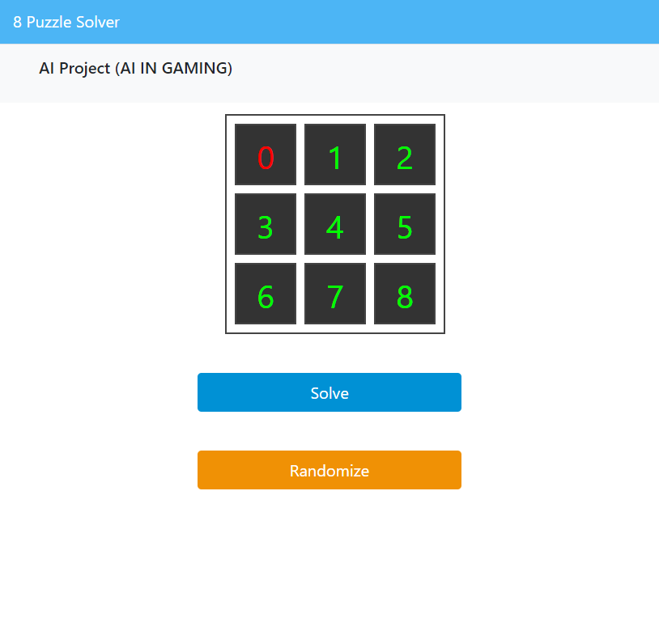

# 8 Puzzel Solver Created Using Django

## Introduction

Hello! Welcome to the 8-puzzle solver project, which utilizes depth-first search (DFS) algorithm to solve the classic 8-puzzle game. In this project, we have implemented an AI agent that can efficiently search through the puzzle space to find the solution to the puzzle. This project showcases how a search algorithm can be used to solve real-world problems, and provides an excellent opportunity to learn and explore the world of artificial intelligence.


### Main features

* Simple and ready to use application with two buttons for randomizing and solving the puzzle

* User can also solve the puzzle manually using mouse clicks

* Bootstrap static files included

* Procfile for easy deployments

* Separated requirements files
      
### Getting Started

This assumes that `python` is linked to valid installation of python and that `pip` is installed and `pip`is valid
for installing python packages.

Installing, creating and activating virtualenv

    $ pip install virtualenv
    $ python -m virtualenv venv
    $ source venv/bin/activate


Installing inside virtualenv is recommended, however you can start your project without virtualenv too.

    $ pip install -r requirements.txt
     
      
After that just install the local dependencies start the development server:

    $ python manage.py runserver

Navigate to the default port on your localhost to see the web application:

```djangourlpath
http://127.0.0.1:8000/
```

## 📸 ScreenShots


### Execution

